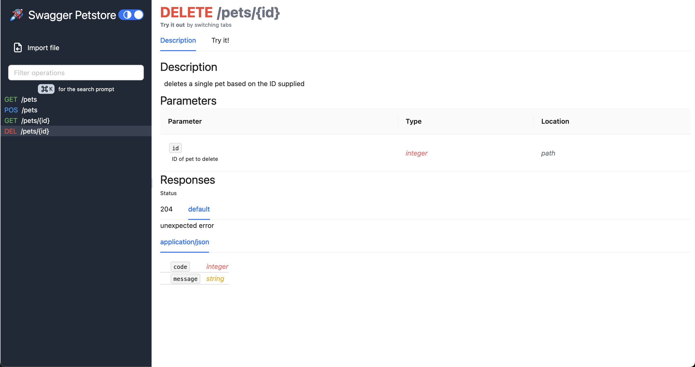

# Rocket Doc


Rocket Doc is a React app that generates documentation from an OpenAPI 3.1 files.

The goal of this project is to provide a simple and easy-to-use tool, with minimal dependencies, to allow for a maintainable and customizable documentation generation.

*Here is an example of the UI with Swagger Petstore example*


# Usage

## As a React Component

You can use Rocket Doc as a React component in your application. First, install the package using yarn or npm:

```bash
yarn add @rocket-doc/app openapi3-ts tailwindcss
# or
npm install @rocket-doc/app openapi3-ts tailwindcss
```

Then, import and use the RocketDoc component in your React application:

```jsx
import React from 'react';
import ReactDOM from 'react-dom';
import { RocketDoc } from '@rocket-doc/app';

ReactDOM.render(
  <RocketDoc
    specUrl="https://api.example.com/openapi.json"
    config={{
      defaultExpandedDepth: 2,
      routerType: "hash"
    }}
  />,
  document.getElementById('root')
);
```

## Directly in the Browser

You can also use Rocket Doc directly in the browser by including the necessary scripts and adding a `<rocket-doc />` DOM element:

```html
<!DOCTYPE html>
<html lang="en">
  <head>
    <meta charset="UTF-8" />
    <link rel="icon" type="image/png" href="/rocket-doc.png" />
    <meta name="viewport" content="width=device-width, initial-scale=1.0" />
    <title>Rocket Doc</title>
    <script crossorigin src="https://unpkg.com/react@18/umd/react.development.js"></script>
    <script crossorigin src="https://unpkg.com/react-dom@18/umd/react-dom.development.js"></script>
    <script crossorigin src="https://unpkg.com/@rocket-doc/app@1.0.1/dist/index.umd.js"></script>
  </head>
  <body>
    <rocket-doc
     spec-url="https://api.example.com/openapi.json"
     config='{"defaultExpandedDepth": 2, "routerType": "hash"}'
     />
  </body>
</html>
```

# Depencies

The goal of this project is to have minimal dependencies. The following are the dependencies used in this project:

#### Building blocks

- [React](https://reactjs.org/)
- [Vite](https://vitejs.dev/)
- [Ant Design](https://ant.design/)
- [Tailwind CSS](https://tailwindcss.com/)
- [Tabler Icons](https://tablericons.com/)
- [React Router DOM](https://www.npmjs.com/package/react-router-dom)


#### For code parsing & formatting
- [PrismJS](https://prismjs.com/)
- [Code Editor](https://www.npmjs.com/package/react-simple-code-editor) # Edition overlay for PrismJS
- [Fast XML Parser](https://www.npmjs.com/package/fast-xml-parser)
- [YAML](https://www.npmjs.com/package/yaml)
- [React Markdown](https://www.npmjs.com/package/react-markdown)

# Features

- [x] OpenAPI 3.1 support
- [x] Schema display
- [x] Operations filtering
- [x] Try it out feature
- [x] Code generation for requests
- [x] Syntax highlighting for requests and responses
- [x] Support for loading OpenAPI files from URL
- [x] Support to retain application credentials
- [x] Support for authenticated routes to get OpenAPI files
- [x] Support for OpenAPI extensions
- [ ] Support for webhooks
- [ ] Support for OAuth 2.0
- [ ] Customizable theme

# Contributing

Feel free to submit issues or pull requests for any improvements or bug fixes.

## Installation

To install the necessary dependencies, run:

```bash
yarn
```

## Running the Application

To start the development server, run:

```bash
yarn dev
```

This will start the application and you can view it in your browser.

## License

This project is licensed under the MIT License.
